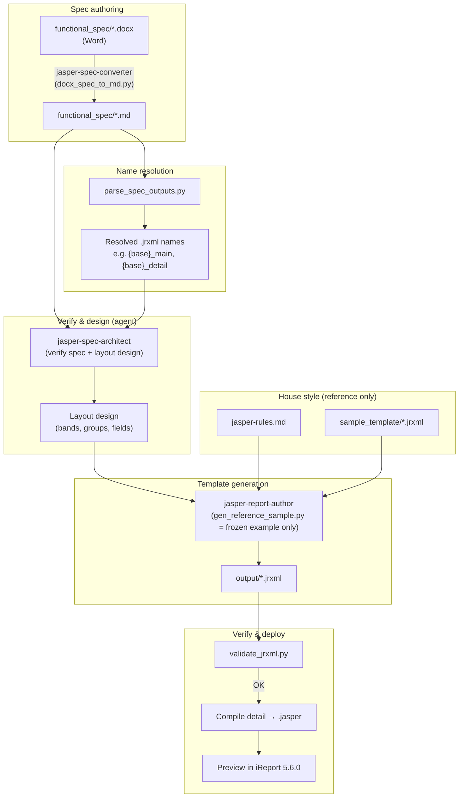

# Jasper Automation

Jasper Automation is a spec-driven toolkit for building JasperReports invoice and statement templates. Business analysts author requirements in Word; the project turns those specs into validated `.jrxml` files that follow your organisation's Jasper house style.

## Pipeline flow




```powershell
python -m venv .venv
.venv\Scripts\pip.exe install -r requirements.txt
```

## Project layout

| Path | Purpose |
|------|---------|
| `functional_spec/` | Word (`.docx`) and Markdown (`.md`) functional specs |
| `sample_template/` | Reference JRXML (`sample_invoice_main.jrxml`, `sample_invoice_detail.jrxml`) for naming, styles, and types only (not layout) |
| `output/` | Generated `.jrxml` files (names derived from the active spec) |
| `scripts/` | Spec conversion, output-name resolution, generation, validation |
| `.cursor/rules/jasper-rules.md` | Binding JRXML conventions |
| `.cursor/commands/generate-jasper-template.md` | Cursor command: orchestrates the converter -> architect -> author sequence |
| `.cursor/agents/jasper-spec-converter.md` | Agent: Word `.docx` -> Markdown `.md` conversion |
| `.cursor/agents/jasper-spec-architect.md` | Agent: verify spec + design layout (read-only) |
| `.cursor/agents/jasper-report-author.md` | Agent: author JRXML from the layout design |

## Generate templates

Use the Cursor command **`/generate-jasper-template`**, or run the steps manually:

### 1. Sync spec (Word → Markdown)

Run when the `.md` is missing, the `.docx` is newer, or Word was edited:

```powershell
.venv\Scripts\python.exe scripts\docx_spec_to_md.py functional_spec\Invoice_Functional_Template.docx
```

Agents and scripts read **`.md` only** — not `.docx`.

### 2. Resolve output file names

Output names are **never hardcoded**. They are derived from the active spec:

```powershell
.venv\Scripts\python.exe scripts\parse_spec_outputs.py functional_spec\Invoice_Functional_Template.md
```

Resolution order (see `.cursor/rules/jasper-rules.md` §6):

1. Explicit **Output files** table in the spec (if present)
2. Template title + **Page** table → `{base}_main.jrxml`, `{base}_detail.jrxml`, etc.
3. Spec filename fallback (strip `_Functional_Template`, convert to `snake_case`)

### 2b. Extract formatting rules

Formatting checklists are **never hardcoded** in agents. They are derived from the spec's **General Instruction(s)** section:

```powershell
.venv\Scripts\python.exe scripts\parse_spec_formatting.py functional_spec\<SPEC>.md
```

Use the JSON `rules` array in the architect layout design and when mapping patterns/expressions in JRXML. If `found` is false, the Word source may need a "General Instruction" heading.

### 3. Verify the spec, design the layout, and author JRXML

For any real spec, use the agent pipeline so the layout tracks the spec. The **`/generate-jasper-template`** command runs the **`jasper-spec-architect`** agent (verifies the spec, emits a reviewable layout design) and then the **`jasper-report-author`** agent (writes the JRXML). The main report references the detail subreport as `{detail_stem}.jasper` under `TEMPLATE_FILE_DIRECTORY`.

For a deterministic copy of the **National Invoice Usage** example only (layout is hardcoded — not spec-driven), run:

```powershell
.venv\Scripts\python.exe scripts\gen_reference_sample.py functional_spec\Invoice_Functional_Template.md
```

Writes spec-derived filenames to `output/`. Do not use this script for other specs.

### 4. Validate

```powershell
.venv\Scripts\python.exe scripts\validate_jrxml.py output\
```

Checks XML well-formedness, duplicate declarations, built-in parameters, layout attributes on `<reportElement>`, UUIDs, band order, single-band sections, `$F`/`$V`/`$P` expression-to-declaration consistency, and subreport wiring.

### 5. Compile to `.jasper`

`.jasper` files are build artifacts (git-ignored) — regenerate them before previewing. Compile the detail subreport (and any others) with:

```powershell
.venv\Scripts\python.exe scripts\compile_jasper.py output\
```

Requires [JasperStarter](https://jasperstarter.sourceforge.io/) on `PATH`, via `--jasperstarter <path>`, or the `JASPERSTARTER` env var. Without it, compile inside iReport 5.6.0 / Jaspersoft Studio (right-click the `.jrxml` -> Compile Report).

## Source of truth

| Concern | Authoritative source |
|---------|----------------------|
| Layout, bands, groups, labels, subreport split | Functional spec (`.md`) |
| Parameter/field naming, styles, types, patterns | Sample templates + `jasper-rules.md` |

## iReport

Templates target **iReport 5.6.0**. After generation, compile the detail `.jrxml` to `.jasper` (see step 5, `scripts/compile_jasper.py`) before previewing the main report.
