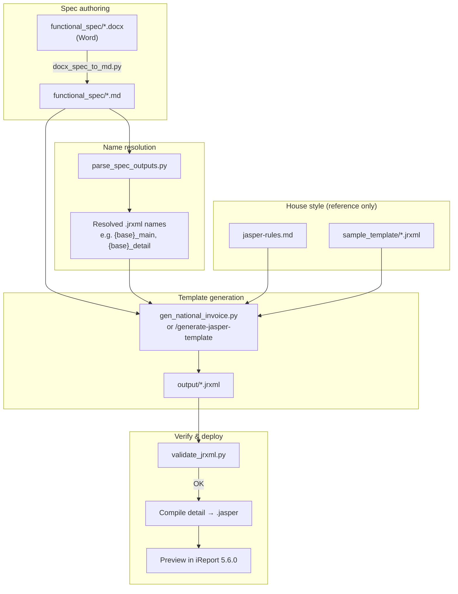

# Jasper Automation

Generate JasperReports (`.jrxml`) templates from functional specifications. Layout and output file names come from the spec; technical conventions come from project rules and optional sample templates.

## Pipeline flow




```powershell
python -m venv .venv
.venv\Scripts\pip.exe install -r requirements.txt
```

## Project layout

| Path | Purpose |
|------|---------|
| `functional_spec/` | Word (`.docx`) and Markdown (`.md`) functional specs — see [functional_spec/README.md](functional_spec/README.md) |
| `sample_template/` | Reference JRXML for naming, styles, and types only (not layout) |
| `output/` | Generated `.jrxml` files (names derived from the active spec) |
| `scripts/` | Spec conversion, output-name resolution, generation, validation |
| `.cursor/rules/jasper-rules.md` | Binding JRXML conventions |
| `.cursor/commands/generate-jasper-template.md` | Cursor command workflow |

## Generate templates

Use the Cursor command **`/generate-jasper-template`**, or run the steps manually:

### 1. Sync spec (Word → Markdown)

Run when the `.md` is missing, the `.docx` is newer, or Word was edited:

```powershell
.venv\Scripts\python.exe scripts\docx_spec_to_md.py functional_spec\Invoice_Functional_Template.docx
```

Agents and scripts read **`.md` only** — not `.docx`.

### 2. Resolve output file names

Output names are **never hardcoded**. They are derived from the active spec:

```powershell
.venv\Scripts\python.exe scripts\parse_spec_outputs.py functional_spec\Invoice_Functional_Template.md
```

Resolution order (see `.cursor/rules/jasper-rules.md` §6):

1. Explicit **Output files** table in the spec (if present)
2. Template title + **Page** table → `{base}_main.jrxml`, `{base}_detail.jrxml`, etc.
3. Spec filename fallback (strip `_Functional_Template`, convert to `snake_case`)

### 3. Generate JRXML

```powershell
.venv\Scripts\python.exe scripts\gen_national_invoice.py functional_spec\Invoice_Functional_Template.md
```

Writes spec-derived filenames to `output/`. The main report references the detail subreport as `{detail_stem}.jasper` under `TEMPLATE_FILE_DIRECTORY`.

### 4. Validate

```powershell
.venv\Scripts\python.exe scripts\validate_jrxml.py output\
```

Checks XML well-formedness, duplicate declarations, built-in parameters, layout attributes on `<reportElement>`, UUIDs, band order, and single-band sections.

## Source of truth

| Concern | Authoritative source |
|---------|----------------------|
| Layout, bands, groups, labels, subreport split | Functional spec (`.md`) |
| Parameter/field naming, styles, types, patterns | Sample templates + `jasper-rules.md` |

## iReport

Templates target **iReport 5.6.0**. After generation, compile the detail `.jrxml` to `.jasper` before previewing the main report.
